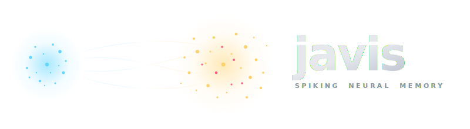
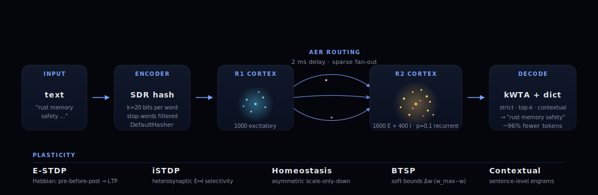

<div align="center">



<br/>

**A token-efficient memory layer for LLM agents, built as a spiking neural network in Rust.**

[](https://www.rust-lang.org)
[](#license)
[](.github/workflows/ci.yml)
[](#tests)
[](#tests)
[](#tests)
[](#token-efficiency)
[](#production-readiness)
[](#run-with-docker)
[](#plasticity)

</div>

---

## Why Javis

Modern LLM pipelines spend most of their token budget on **retrieval context**.
Naive RAG ships an entire chunk to the model on every query — even when only
a single fact inside that chunk matters.

Javis flips the architecture: knowledge is stored as **emergent cell assemblies**
in a spiking neural network. A query is a partial cue; pattern completion
inside the network reactivates the relevant assembly; only the few decoded
concepts go to the LLM.

```
Naive RAG:   "Rust is a systems programming language focused on memory
              safety and ownership; the borrow checker prevents data races
              at compile time."                                       63 tokens
Javis:       "rust"                                                    2 tokens
                                                                     ─ 96.8% ─
```

Numbers verified by an integration test on a 5-topic Wikipedia-shaped corpus
(see [`crates/eval/tests/wiki_benchmark.rs`](crates/eval/tests/wiki_benchmark.rs)).

---

## Architecture

<div align="center">
  
</div>

The full pipeline runs end-to-end: text in, encoded into a Sparse Distributed
Representation, injected into R1 (input cortex), routed via address-event
spikes into R2 (memory cortex) where STDP, iSTDP and homeostasis shape an
engram, then read out by kWTA and an engram dictionary back into a list of
text concepts.

Every box on the diagram corresponds to a real Rust module:

| Stage | Module |
| --- | --- |
| `Text → SDR` | [`crates/encoders`](crates/encoders) |
| `R1 / R2 / AER` | [`crates/snn-core`](crates/snn-core) |
| `Plasticity` | [`crates/snn-core`](crates/snn-core) (`stdp`, `istdp`, `homeostasis`) |
| `Decode` | [`crates/encoders/src/decode.rs`](crates/encoders/src/decode.rs) |
| `Eval / RAG` | [`crates/eval`](crates/eval) |
| `LLM (Anthropic)` | [`crates/llm`](crates/llm) |
| `Live UI` | [`crates/viz`](crates/viz) |

---

## Quick start

```sh
# build everything
cargo build --release

# run the full test suite (98/98 should pass)
cargo test --release

# minimal 30-line demo printing RAG vs Javis token saving
cargo run --release -p eval --example hello_javis

# fire up the live 3D brain in a browser
cargo run -p viz --release --bin javis-viz
# → http://127.0.0.1:7777
```

Optional persistent brain:

```sh
cargo run -p viz --release -- --snapshot brain.json
# trains the bootstrap corpus, persists on Ctrl-C, reloads on next start
```

Optional real Claude API calls (otherwise the LLM adapter runs in mock mode):

```sh
ANTHROPIC_API_KEY=sk-ant-... cargo run -p viz --release
# the "send both to Claude" button now fires real calls
```

### Run with Docker

A multi-stage `Dockerfile` plus a `docker-compose.yml` brings up the
full observability stack — Javis, Prometheus, and Grafana — in one
command:

```sh
docker compose up --build
```

| URL | What |
| --- | --- |
| http://localhost:7777 | Javis 3D brain (WebSocket + frontend) |
| http://localhost:7777/metrics | Prometheus exposition |
| http://localhost:9090 | Prometheus UI (already scraping Javis) |
| http://localhost:3000 | Grafana, Javis dashboard pre-provisioned |

The brain state lives on a named volume (`javis-data:/app/data`),
so `docker compose restart` saves a `brain.snapshot.json` on
shutdown and reloads it on startup — no retraining needed.

The Grafana instance runs anonymous-admin and the Prometheus
datasource is auto-wired — meant for local-dev only, see
`docker-compose.yml` for the relevant `GF_AUTH_*` flags before
exposing it anywhere.

---

## Live 3D brain

Open `http://127.0.0.1:7777` and you get a Three.js / `3d-force-graph` view of
the live brain:

- Two anatomical lobes — R1 input cortex (blue) and R2 memory cortex (yellow)
  with embedded inhibitory cells (pink)
- Spike pulses light each neuron as it fires, fading back over ~220 ms
- A side panel streams phase, live spike rates, decoded concepts, the token
  saving headline and the actual RAG-vs-Javis payloads
- Two text inputs let you live-train sentences and live-query the brain
- A "send both to Claude" button fires both payloads to the Anthropic API in
  parallel and shows the answers + real input/output token counts

---

## Plasticity

Javis composes five biologically-motivated plasticity mechanisms, each opt-in:

| Mechanism | Purpose | Reference |
| --- | --- | --- |
| **LIF dynamics** | leaky integrate-and-fire neurons with refractory period | classical |
| **Pair STDP (E)** | Hebbian potentiation between excitatory neurons | Bi & Poo 1998 |
| **iSTDP** | heterosynaptic plasticity at I→E, gives engram selectivity | Vogels et al. 2011 |
| **Asymmetric homeostasis** | scale-only-down multiplicative renormalisation | Turrigiano 2008 |
| **BTSP soft bounds** | `Δw = a · trace · (w_max − w)` instead of hard clamp | Bittner 2017 / Milstein 2024 |
| **Contextual engrams** | fingerprints captured during co-activity, not post-hoc | Tonegawa engram-cell line |

The math behind each lives in `crates/snn-core/src/{stdp,istdp,homeostasis}.rs`,
the trade-offs are documented in [`notes/`](notes).

---

## Token efficiency

Two integration tests measure Javis against a naive RAG baseline:

| Corpus | Mean RAG | Mean Javis | Mean reduction |
| --- | ---: | ---: | ---: |
| 3 paragraphs about programming languages | 27 tok | 2.3 tok | **91.3 %** |
| 5 Wikipedia-shaped paragraphs (geology, transport, biology, …) | 60 tok | 2.0 tok | **96.6 %** |

Run them yourself:

```sh
cargo test -p eval --release token_efficiency  -- --nocapture
cargo test -p eval --release wiki_benchmark    -- --nocapture
```

---

## Production readiness

What separates Javis from a typical research demo:

**Observability** (notes 24–26)

| Endpoint | Purpose |
| --- | --- |
| `tracing` + `RUST_LOG` | structured logs, JSON mode via `JAVIS_LOG_FORMAT=json`, per-WebSocket-session spans |
| `GET /health` | liveness — always 200 |
| `GET /ready` | readiness — JSON with `sentences`, `words`, `llm` mode |
| `GET /metrics` | Prometheus exposition: counters, histograms (5 ms – 30 s buckets), gauges |

**Supply-chain** (notes 27–30)

| Tool | Where | Catches |
| --- | --- | --- |
| `cargo-deny` | CI `deny` job | RustSec advisories, license drift, banned/duplicate crates, unknown sources |
| Pinned MSRV (1.86) | CI `msrv` job | accidental use of newer-rustc-only features |
| Dependabot | weekly | grouped `cargo` and `github-actions` updates |
| `cargo doc -D warnings` | CI `docs` job | broken intra-doc links, invalid codeblock attrs |

**Container** (notes 32–33)

| | |
| --- | --- |
| Multi-stage `Dockerfile` | `rust:1.86-bookworm` builder → `debian:bookworm-slim` runtime, ~150 MB final |
| Non-root user | `javis` (uid 1000) with `tini` as PID 1 |
| HEALTHCHECK | `curl /health`, 15 s interval |
| Snapshot volume | `javis-data:/app/data` survives restarts |
| Optional CA secret | for sandbox / corporate-proxy environments |

**Performance baselines** (note 31, local x86_64 Linux)

| Path | Time |
| --- | ---: |
| `Network::step` (1 000 neurons, sparse, passive) | 3.2 µs |
| `Network::step` (1 000 neurons, sparse, +STDP) | 3.4 µs |
| `Brain::step` (two regions × 1 000) | 7.7 µs |
| `encode_sentence` (18 words) | 21 µs |
| `decode_strict` (vocab 1 000) | 253 µs |

**End-to-end load profile** (note 38, against `docker compose` stack)

| Concurrent WS clients | Throughput | p50 / p99 latency | Server-mean |
| ---: | ---: | ---: | ---: |
| 1 | 112 ops/s | 8.8 / 11 ms | 7 ms |
| 10 | 357 ops/s | 27 / 48 ms | 9 ms |
| 50 | 359 ops/s | 141 / 244 ms | 9 ms |
| 100 | 358 ops/s | 270 / 564 ms | 9 ms |

Recall runs against an `Arc<RwLock<Inner>>` with a per-call
`BrainState`, so multiple recalls proceed in parallel. Server-side
latency stays flat at ~9 ms regardless of concurrency; remaining
client-side p99 growth is tokio-runtime queueing of TCP connections.
Bound is now CPU cores, not Mutex serialisation.

CI runs eight jobs on every push: `fmt`, `clippy -D warnings`,
`test`, `doc-tests`, `deny`, `msrv`, `docs`, `benches` (compile-only).

---

## Project structure

```
javis/
├── crates/
│   ├── snn-core/   ─ LIF neurons, STDP, iSTDP, homeostasis, BTSP, AER routing
│   ├── encoders/   ─ Text → SDR (DefaultHasher, k-of-n) + EngramDictionary
│   ├── eval/       ─ Token-efficiency benchmarks vs. naive RAG
│   ├── llm/        ─ Anthropic API adapter (real + deterministic mock)
│   └── viz/        ─ Axum + WebSocket server, 3D-force-graph frontend
├── notes/          ─ 38 research notes — every decision documented
├── scripts/        ─ End-to-end sanity check + load test (Python)
├── deploy/         ─ Prometheus + Grafana provisioning for docker-compose
└── assets/         ─ Logo and architecture diagram (programmatic SVG)
```

---

## Tests

```sh
cargo test --release
```

| Suite | Tests | Validates |
| --- | ---: | --- |
| `snn-core` | 54 | LIF dynamics, STDP & iSTDP, homeostasis, BTSP soft bounds, E/I balance, multi-region routing, snapshot serde, assembly formation, bounds-checked APIs, heap pending queue, AMPA/NMDA/GABA channels, read-only step equivalence |
| `encoders` | 22 | SDR union/overlap, hash determinism, top-k decode, injection, full pattern completion |
| `eval` | 12 | RAG-vs-Javis token efficiency, Wikipedia scaling, intra-topic recall, contextual mode |
| `llm` | 3 | Anthropic adapter mock contract, token heuristic |
| `viz` | 16 | WebSocket smoke, train+recall, ask both, snapshot round-trip, `/health` + `/ready`, `/metrics`, concurrency cap, snapshot schema migration (v1→v2) |
| Doc-tests | 3 | Public quick-start examples in `snn-core` and `encoders` |
| **Total** | **108** | with **zero clippy warnings** workspace-wide |

---

## Documentation

Every iteration is logged in [`notes/`](notes). Each note explains
**what changed, why, and what was measured**:

| Note | Topic |
| --- | --- |
| 00 | Architecture sketch |
| 01 | snn-core baseline |
| 02 | Assembly formation + throughput budget |
| 03 | E/I balance + sparse adjacency |
| 04 | Multi-region AER |
| 05 | Encoder stub |
| 06 | Pattern completion |
| 07 | Homeostatic scaling |
| 08 | Pattern completion with homeostasis |
| 09 | Decoder |
| 10 | Multi-concept coexistence |
| 11 | iSTDP — intrinsic selectivity |
| 12 | Token-efficiency benchmark |
| 13 | Live visualisation iter 1 (raster) |
| 14 | Live visualisation iter 2 (3D brain) |
| 15 | Live visualisation iter 3 (persistent training) |
| 16 | Live visualisation iter 4 (Claude API) |
| 17 | Persistence (snapshots) |
| 18 | Wikipedia scaling |
| 19 | Two decode modes |
| 20 | Bio-inspired optimisations: contextual engrams + BTSP |
| 21 | Architecture hardening: dead code, bounds checks, lints |
| 22 | Min-heap pending queue, AMPA/NMDA/GABA channels, zero lints |
| 23 | Production polish: CI, doc-tests, examples, CHANGELOG |
| 24 | Structured logging via `tracing` (RUST_LOG, JSON mode, session spans) |
| 25 | `/health` (liveness) + `/ready` (readiness with brain stats) |
| 26 | Prometheus metrics: `/metrics` endpoint, counters/histograms/gauges |
| 27 | Supply-chain hygiene: `cargo-deny` (advisories + licenses + bans + sources) |
| 28 | MSRV pinned to Rust 1.86, dedicated CI job |
| 29 | Dependabot (cargo + github-actions, grouped weekly updates) |
| 30 | `cargo doc -D warnings` as CI gate |
| 31 | Criterion benchmarks for `Network::step`, `Brain::step`, encode/decode |
| 32 | Container & deploy: Dockerfile + docker-compose with Prometheus + Grafana |
| 33 | Docker stack verified end-to-end + snapshot volume |
| 34 | End-to-end sanity script + Grafana datasource UID fix |
| 35 | Load test: ~141 recalls/sec sustained, Mutex-serialised, no leak |
| 36 | Concurrency cap: Semaphore + 503/Retry-After, `JAVIS_MAX_CONCURRENT_SESSIONS` |
| 37 | Snapshot schema versioning: v2 with metadata, migration chain, v1 backward-compat |
| 38 | Read-only recall: `Brain::step_immutable` + `RwLock`, 2.5× throughput |

---

## References

The plasticity rules and architectural choices come from current SNN
literature. Key papers:

- A. C. Vogels et al. — [Inhibitory Plasticity Balances Excitation and Inhibition](https://www.science.org/doi/10.1126/science.1211095) · _Science_ 2011
- A. D. Milstein et al. — [Rapid memory encoding in a recurrent network model with BTSP](https://pmc.ncbi.nlm.nih.gov/articles/PMC10484462/) · _PLOS Comp Bio_ 2023
- L. Bittner et al. — [Behavioral Time Scale Synaptic Plasticity (Nature Comms 2024)](https://www.nature.com/articles/s41467-024-55563-6)
- Caligiore et al. — [Selective inhibition in CA3](https://journals.plos.org/ploscompbiol/article?id=10.1371/journal.pcbi.1013267) · _PLOS Comp Bio_ 2024
- L. Hu et al. — [Dynamic and selective engrams emerge with memory consolidation](https://www.nature.com/articles/s41593-023-01551-w) · _Nature Neurosci._ 2024

---

## License

MIT — see [`LICENSE`](LICENSE).
