<div align="center">



<br/>

**An associative SNN memory co-processor for LLM agents, built in Rust.**

A spiking neural network that stores knowledge as emergent cell assemblies and
retrieves it through pattern completion. Sits between your retrieval layer and
your LLM, returning a few decoded concepts instead of full document chunks.

[](https://www.rust-lang.org)
[](#license)
[](.github/workflows/ci.yml)
[](#tests)
[](#tests)
[](#tests)
[](#performance-profile)
[](#performance-profile)
[](#production-readiness)
[](#run-with-docker)
[](#plasticity)
[](#iterations)

> **⚠ Research-only license.** Javis is licensed under
> [PolyForm Noncommercial 1.0.0](LICENSE). It is **not** for production
> deployment, commercial integration, or any operational system that affects
> real people, real decisions, real services, or real infrastructure. See the
> [research-use addendum](LICENSE#project-specific-research-use-addendum-non-binding-intent-statement)
> for the licensor's intent statement.

</div>

---

## Table of contents

- [Why Javis](#why-javis) — the pitch in 30 seconds.
- [Architecture diagram](#architecture-diagram) — animated R1 → DG → R2 walk-through.
- [Performance profile](#performance-profile) — what the network actually does today.
- [Architecture (text)](#architecture) — the iter-44 plasticity stack and decoder.
- [Quick start](#quick-start) — clone → build → recall.
- [Live 3D brain](#live-3d-brain) — the in-browser visualisation.
- [Plasticity](#plasticity) — STDP / iSTDP / BCM / R-STDP / homeostasis.
- [Token efficiency](#token-efficiency--the-small-corpus-picture) — Javis vs. naive RAG.
- [Production readiness](#production-readiness) — tracing, metrics, container, MSRV, deny.
- [Project structure](#project-structure) — the workspace layout.
- [Tests](#tests) — what runs in CI and what the gates are.
- [Iterations](#iterations) — every hypothesis, pre-fixed criterion, and verdict from iter-00 to today.
- [References](#references) — papers behind the plasticity choices.
- [License](#license) — research-use only.

---

## Why Javis

Modern LLM pipelines spend most of their token budget on **retrieval context**.
Naive RAG ships an entire chunk to the model on every query — even when only
a single fact inside that chunk matters.

Javis flips the architecture: knowledge is stored as **emergent cell assemblies**
in a spiking neural network. A query is a partial cue; pattern completion
inside the network reactivates the relevant assembly; only the few decoded
concepts go to the LLM.

```
Naive RAG:   "Rust is a systems programming language focused on memory
              safety and ownership; the borrow checker prevents data races
              at compile time."                                       63 tokens
Javis:       "rust"                                                    2 tokens
```

That gap is the whole pitch. Whether it holds at scale — and where it stops
holding — is reported below in plain numbers, not slogans.

---

## Architecture diagram

The iter-60+ DG bridge architecture, with spike pulses propagating from R1
(input cortex, k=20 SDR) through the DG hash (4 000 cells, k-of-n sparse code)
and the direct perforant path (configurable scale, iter-64 sweet-spot at 0.3)
into R2 (memory cortex, 2 000 LIF, 70 % E + 30 % I, fully recurrent with
STDP / iSTDP / BCM / homeostasis / intrinsic-θ / R-STDP / heterosynaptic /
structural plasticity). A 3-second loop:

<div align="center">



</div>

**The blue paths (R1 → DG → R2 mossy fibres)** are always on at full
weight; **the dashed grey path (direct R1 → R2 perforant)** is the iter-64
mechanism diagnosis axis — at scale `0.0` (DG-only, iter-63 baseline) the
brain separates cues but does not learn cue → target on the decoder; at
scale `0.3` it does (iter-64 axis C verdict, see [Iterations](#iterations)).

---

## Performance profile

Measured on a deterministic 100-sentence / 286-vocabulary benchmark
(`cargo run --release -p eval --example scale_benchmark -- --sentences 100`).
Reproducible from a single `--seed`; no external dataset, no network.

### What survives

| Property | Value |
| --- | ---: |
| **Self-recall** (query concept always retrievable) | **100 %** |
| **Token reduction** vs naïve-RAG baseline | **35 – 45 %** |
| **Decoder latency** at vocab ≤ 300 | sub-millisecond |
| **Self-recall test suite** | 113 / 113 passing |

The first row is the architectural claim that Javis stands behind: train a
concept once, recall it deterministically. The second row is the headline
number — modest but real, on a non-toy corpus. The third row makes Javis
practical as a co-processor in front of an LLM.

### Known limits (iter ≤24 baseline)

These are the failure modes a senior reviewer would find on day one. Better
to publish them than have someone tweet them.

| Limit | Measured value | Mechanism |
| --- | ---: | --- |
| **Associative recall** | ≈ 2 % | Of every word that genuinely co-occurs with the query in the corpus, only ~ 2 % is decoded. Javis returns the query plus 5 noise words, not the expected 5–10 related concepts. |
| **Cross-domain bleed** | 4.7 / 6 decoded words | At N > 50 distinct concepts the R2 layer (2 000 neurons, K=220, 11 % sparsity) saturates; iSTDP can no longer build separating walls between engrams, so unrelated domains leak into each other. |
| **Engram capacity** | ≈ 50 concepts | Geometric upper bound from R2_size / KWTA_K = 2 000 / 220 ≈ 9 fully-orthogonal engrams; with overlap-tolerance about 50 work cleanly before interference dominates. |

### What changes in iter 25 (this branch)

R2 was scaled from 2 000 → 10 000 neurons, recurrent connectivity sparsened
from p=0.10 → p=0.03, KWTA from 220 → 100 (1 % sparsity), iSTDP retuned for
aggressive LTD on co-active E-targets. The 113 existing tests still pass at
the new topology. Updated cross-bleed and recall numbers are in
[`notes/43-topology-scaling.md`](notes/43-topology-scaling.md) once the
benchmark run completes.

### What changes in iter 47a (this branch)

The iter-46 negative-margin diagnosis identified the R1 → R2 forward
drive as the dominant factor in the cue's R2 response. Iter-47a tests
the literature-grounded fix (Brunel scaling + Diehl-Cook adaptive
threshold) through a sequential 4-epoch sweep with pre-fixed
acceptance criteria. Result, on the same 16 + 16 pair / vocab-32
corpus, seed 42:

| INTER_WEIGHT | r2_act mean | tgt_hit | selectivity | margin |
| ---: | ---: | ---: | ---: | ---: |
| 0.5 | 0.8 | 0.00 | -0.0005 | -0.01 |
| 1.0 | 139 | 2.59 | -0.0005 | -0.02 |
| 0.7 | 507 (cascade) | 9.38 | -0.0047 | -0.02 |

iter-47a-2 alone does **not** flip the margin sign. But the
diagnosis is sharper than iter-46's: at INTER_WEIGHT = 1.0,
`target_hit_mean` grew monotonically over 4 epochs (1.16 → 2.59)
and `selectivity_index` rose from -0.022 to -0.0005 — the right
direction. The 0.7 bistability (recurrent cascade in epoch 3) is
the key second-order finding: hard sparsity control (k-WTA, iter-48
entry) is necessary, not optional. The iter-47 metrics
(`r2_active_pre_teacher_{mean,p10,p90}`, `selectivity_index`) are
wired to A/B-test it cleanly. See
[`notes/47a`](notes/47a-forward-drive-and-adaptive-threshold.md).

### What changes in iter 46 (this branch)

The pair-association harness from iter-45 grows a *teacher-forcing*
training arm: a deterministic per-word canonical R2-E SDR
(`canonical_target_r2_sdr`) and a `drive_with_r2_clamp` primitive
that injects target spikes directly into R2 — bypassing the
random R1 → R2 forward path. Plus a six-phase trial schedule
(cue → delay → prediction → teacher → reward → tail) with
plasticity gating around the prediction window so evaluation
never contaminates training, an anti-causal STDP timing fix
(cue lead-in before the clamp), and a `--association-training-
gate-r1r2` flag to attenuate forward drive during the prediction
phase only.

Honest result on the same 16-pair + 16-noise corpus, seed 42:
`target_clamp_hit_rate = 1.00` across every teacher epoch (the
clamp itself works perfectly), but `correct_minus_incorrect_margin`
stays in `[-0.06, -0.03]` — the canonical-target cells fire
*less* than the rest under cue-only recall, even with the
timing fix and the R1 → R2 gate. The first non-zero
`prediction_top3_before_teacher = 0.02` appears at epoch 3 with
homeostasis on, but does not stabilise above the 9.4 % chance
floor in any run. The bottleneck has moved from iter-45's "we
can't measure it" to iter-46's "we can measure it; here is the
number". See [`notes/46`](notes/46-teacher-forcing.md) for the
full chain of measurements and the next-iter (47) directions
(reduce `INTER_WEIGHT`, add an association-bridge region, or
make R1 → R2 itself learnable).

### What changes in iter 45 (this branch)

A *reward-aware pair-association benchmark*
(`cargo run --release -p eval --example reward_benchmark`) that
finally lets the iter-44 R-STDP / dopamine machinery be exercised:
16 (cue, target) pairs with 16 distractor pairs, staggered
cue → target training, per-trial reward delivery, per-epoch
top-1 / top-3 readout. Pure STDP is run as the baseline arm.

The honest reading: **neither arm reaches above-chance accuracy in
the available training time**. R-STDP shows a small advantage on
noise suppression (mean noise-top-3 `0.10` vs pure STDP `0.16`)
but the architecture's R1 → R2 forward path dominates the cue's
R2 representation, leaving STDP too little room to grow strong
recurrent associations. The infrastructure is in place; the next
experiment (teacher-forcing the target SDR into R2 during
training) is documented in
[`notes/45`](notes/45-reward-bench.md).

### What changes in iter 44.1 (this branch)

A *decoder confidence floor* via `--decode-threshold` (default `0.0`
= pre-iter-44 behaviour, recommended `0.2` for the 32-sentence
corpus). The original `decode_top` always returned `k` results even
when the highest scoring engram sat right at the random-overlap
baseline (`KWTA_K / R2_E = 12.5 %`). The floor omits low-confidence
matches instead of filling the slot with garbage.

Measured on the same 32-sentence corpus, seed 42, `--iter44 off`:

| `--decode-threshold` | FP / Q | Token reduction | Self-recall |
| ---: | ---: | ---: | ---: |
| `0.0` (pre-iter-44) | 4.50 | 38.9 % | 100 % |
| **`0.20`** | **0.62** | **79.7 %** | 100 % |
| `0.30` | 0.00 | 84.7 % | 100 % |

That is **FP − 86 %** and **token reduction × 2.0** with no plasticity
change at all; the SNN's engrams were already orthogonal, the decoder
just refused to admit it.

### What changes in iter 44 (this branch)

Seven new biology-grade plasticity mechanisms join the existing
LIF / STDP / iSTDP / homeostasis / BTSP stack, all opt-in and
default-off so every pre-iter-44 test stays bit-identical.

**Honest benchmark result**: on the deterministic 32-sentence corpus
(seed 42), the new mechanisms *do not* improve recall over the
iter-43 baseline out of the box — `off` 4.4 %, `stability` 4.4 %,
`tuned` 2.7 %, `full` 1.6 %. Heterosynaptic / BCM scale weights
uniformly per post and don't change the kWTA fingerprint;
reward-modulated STDP and replay both need longer training windows
or a reward signal the current eval harness does not provide. The
stack is infrastructure for the *next* benchmark — multi-epoch
streaming corpora and reward-aware retrieval — see
[`notes/44`](notes/44-breakthrough-plasticity.md) for the full
reading. The mechanisms themselves:

1. **Triplet STDP** (Pfister-Gerstner 2006) — frequency-dependent LTP.
2. **Reward-modulated STDP with eligibility traces** — three-factor
   learning, gated by `Brain::set_neuromodulator(...)` (the
   dopamine surrogate). Closes the temporal-credit-assignment loop
   that pure pair-STDP cannot solve.
3. **BCM metaplasticity** — sliding LTP/LTD threshold per post-neuron;
   stops the runaway-LTP failure mode under sustained drive.
4. **Intrinsic plasticity** — adaptive per-neuron threshold; every
   cell drifts towards its target rate, no dead or saturated neurons.
5. **Heterosynaptic L2 normalisation** — the direct fix for the R2
   saturation problem in `notes/43`. Hard-bounds each post-neuron's
   incoming-weight budget.
6. **Structural plasticity** — sprout new edges between repeatedly
   co-active E cells, prune persistently-dormant ones. Engram
   capacity stops being a hard topology constant.
7. **Offline replay / consolidation** — `Brain::consolidate(...)`
   drives the top-k engram cells in pulses with full plasticity on,
   the way slow-wave-sleep replay deepens hippocampal engrams.

Switch the whole stack on in the live viz with
`JAVIS_ITER44=1 cargo run -p viz --release`.

The full architectural rationale, composition into the existing
pipeline, and 15 new tests are documented in
[`notes/44-breakthrough-plasticity.md`](notes/44-breakthrough-plasticity.md).

### Reproducibility

```sh
# Train + evaluate on 100 sentences. ~5 min wall on R2=10 000.
cargo run --release -p eval --example scale_benchmark \
    -- --sentences 100 --queries 30 --decode-k 6 --seed 42

# Smaller smoke run for CI / quick checks (~30 s):
cargo run --release -p eval --example scale_benchmark -- --sentences 32
```

The benchmark prints a Markdown summary table; redirect stdout to capture it
verbatim into a release note.

---

## Architecture

<div align="center">
  
</div>

The full pipeline runs end-to-end: text in, encoded into a Sparse Distributed
Representation, injected into R1 (input cortex), routed via address-event
spikes into R2 (memory cortex) where STDP, iSTDP and homeostasis shape an
engram, then read out by kWTA and an engram dictionary back into a list of
text concepts.

Every box on the diagram corresponds to a real Rust module:

| Stage | Module |
| --- | --- |
| `Text → SDR` | [`crates/encoders`](crates/encoders) |
| `R1 / R2 / AER` | [`crates/snn-core`](crates/snn-core) |
| `Plasticity` | [`crates/snn-core`](crates/snn-core) (`stdp`, `istdp`, `homeostasis`) |
| `Decode` | [`crates/encoders/src/decode.rs`](crates/encoders/src/decode.rs) |
| `Eval / RAG` | [`crates/eval`](crates/eval) |
| `LLM (Anthropic)` | [`crates/llm`](crates/llm) |
| `Live UI` | [`crates/viz`](crates/viz) |

---

## Quick start

```sh
# build everything
cargo build --release

# run the full test suite (98/98 should pass)
cargo test --release

# minimal 30-line demo printing RAG vs Javis token saving
cargo run --release -p eval --example hello_javis

# fire up the live 3D brain in a browser
cargo run -p viz --release --bin javis-viz
# → http://127.0.0.1:7777
```

Optional persistent brain:

```sh
cargo run -p viz --release -- --snapshot brain.json
# trains the bootstrap corpus, persists on Ctrl-C, reloads on next start
```

Optional real Claude API calls (otherwise the LLM adapter runs in mock mode):

```sh
ANTHROPIC_API_KEY=sk-ant-... cargo run -p viz --release
# the "send both to Claude" button now fires real calls
```

### Run with Docker

A multi-stage `Dockerfile` plus a `docker-compose.yml` brings up the
full observability stack — Javis, Prometheus, and Grafana — in one
command:

```sh
docker compose up --build
```

| URL | What |
| --- | --- |
| http://localhost:7777 | Javis 3D brain (WebSocket + frontend) |
| http://localhost:7777/metrics | Prometheus exposition |
| http://localhost:9090 | Prometheus UI (already scraping Javis) |
| http://localhost:3000 | Grafana, Javis dashboard pre-provisioned |

The brain state lives on a named volume (`javis-data:/app/data`),
so `docker compose restart` saves a `brain.snapshot.json` on
shutdown and reloads it on startup — no retraining needed.

The Grafana instance runs anonymous-admin and the Prometheus
datasource is auto-wired — meant for local-dev only, see
`docker-compose.yml` for the relevant `GF_AUTH_*` flags before
exposing it anywhere.

---

## Live 3D brain

Open `http://127.0.0.1:7777` and you get a Three.js / `3d-force-graph` view of
the live brain:

- Two anatomical lobes — R1 input cortex (blue) and R2 memory cortex (yellow)
  with embedded inhibitory cells (pink)
- Spike pulses light each neuron as it fires, fading back over ~220 ms
- A side panel streams phase, live spike rates, decoded concepts, the token
  saving headline and the actual RAG-vs-Javis payloads
- Two text inputs let you live-train sentences and live-query the brain
- A "send both to Claude" button fires both payloads to the Anthropic API in
  parallel and shows the answers + real input/output token counts

---

## Plasticity

Javis composes twelve biologically-motivated plasticity mechanisms, each opt-in:

| Mechanism | Purpose | Reference |
| --- | --- | --- |
| **LIF dynamics** | leaky integrate-and-fire neurons with refractory period | classical |
| **Pair STDP (E)** | Hebbian potentiation between excitatory neurons | Bi & Poo 1998 |
| **iSTDP** | heterosynaptic plasticity at I→E, gives engram selectivity | Vogels et al. 2011 |
| **Asymmetric homeostasis** | scale-only-down multiplicative renormalisation | Turrigiano 2008 |
| **BTSP soft bounds** | `Δw = a · trace · (w_max − w)` instead of hard clamp | Bittner 2017 / Milstein 2024 |
| **Contextual engrams** | fingerprints captured during co-activity, not post-hoc | Tonegawa engram-cell line |
| **Triplet STDP** *(iter-44)* | frequency-dependent LTP via slow `r2` / `o2` traces | Pfister & Gerstner 2006 |
| **Reward-modulated STDP** *(iter-44)* | three-factor learning, dopamine-gated eligibility tag | Frémaux & Gerstner 2016; Izhikevich 2007 |
| **Metaplasticity (BCM)** *(iter-44)* | sliding LTP/LTD threshold per post-neuron | BCM 1982; Cooper & Bear 2012 |
| **Intrinsic plasticity (SFA)** *(iter-44)* | adaptive per-neuron threshold | Desai 1999; Chrol-Cannon 2014 |
| **Heterosynaptic L1/L2 norm** *(iter-44)* | per-post incoming-weight budget | Royer & Paré 2003; Field 2020 |
| **Structural plasticity** *(iter-44)* | sprout + prune to grow/shrink topology | Yang 2009; Holtmaat & Svoboda 2009 |
| **Offline replay / consolidation** *(iter-44)* | drives top-k engram cells with plasticity on | Buzsáki 2015; Wilson & McNaughton 1994 |

The math behind each lives in `crates/snn-core/src/{stdp,istdp,homeostasis,
metaplasticity,intrinsic,heterosynaptic,structural,reward,replay}.rs`,
the trade-offs are documented in [`notes/`](notes), and the full iter-44
rationale is in [`notes/44-breakthrough-plasticity.md`](notes/44-breakthrough-plasticity.md).

---

## Token efficiency — the small-corpus picture

Two integration tests measure Javis against a naïve RAG baseline on small,
hand-curated corpora. The numbers here are favourable to Javis (each query
returns a single decoded concept, full RAG returns the whole paragraph) and
are the *floor* of the architecture's reach, not its ceiling:

| Corpus | Mean RAG | Mean Javis | Mean reduction |
| --- | ---: | ---: | ---: |
| 3 paragraphs about programming languages | 27 tok | 2.3 tok | 91.3 % |
| 5 Wikipedia-shaped paragraphs (geology, transport, biology, …) | 60 tok | 2.0 tok | 96.6 % |

These are the *ideal-conditions* numbers. For the benchmark that includes
every realistic failure mode — cross-bleed, missed co-occurrences, decoder
saturation — read [Performance profile](#performance-profile) above.

```sh
cargo test -p eval --release token_efficiency  -- --nocapture
cargo test -p eval --release wiki_benchmark    -- --nocapture
```

---

## Production readiness

What separates Javis from a typical research demo:

**Observability** (notes 24–26)

| Endpoint | Purpose |
| --- | --- |
| `tracing` + `RUST_LOG` | structured logs, JSON mode via `JAVIS_LOG_FORMAT=json`, per-WebSocket-session spans |
| `GET /health` | liveness — always 200 |
| `GET /ready` | readiness — JSON with `sentences`, `words`, `llm` mode |
| `GET /metrics` | Prometheus exposition: counters, histograms (5 ms – 30 s buckets), gauges |

**Supply-chain** (notes 27–30)

| Tool | Where | Catches |
| --- | --- | --- |
| `cargo-deny` | CI `deny` job | RustSec advisories, license drift, banned/duplicate crates, unknown sources |
| Pinned MSRV (1.86) | CI `msrv` job | accidental use of newer-rustc-only features |
| Dependabot | weekly | grouped `cargo` and `github-actions` updates |
| `cargo doc -D warnings` | CI `docs` job | broken intra-doc links, invalid codeblock attrs |

**Container** (notes 32–33)

| | |
| --- | --- |
| Multi-stage `Dockerfile` | `rust:1.86-bookworm` builder → `debian:bookworm-slim` runtime, ~150 MB final |
| Non-root user | `javis` (uid 1000) with `tini` as PID 1 |
| HEALTHCHECK | `curl /health`, 15 s interval |
| Snapshot volume | `javis-data:/app/data` survives restarts |
| Optional CA secret | for sandbox / corporate-proxy environments |

**Performance baselines** (note 31, local x86_64 Linux)

| Path | Time |
| --- | ---: |
| `Network::step` (1 000 neurons, sparse, passive) | 3.2 µs |
| `Network::step` (1 000 neurons, sparse, +STDP) | 3.4 µs |
| `Network::step_immutable` (1 000 neurons, recall path, post-SoA) | **2.7 µs** |
| `Brain::step` (two regions × 1 000) | 7.7 µs |
| `encode_sentence` (18 words) | 21 µs |
| `decode_strict` (vocab 1 000) | 253 µs |

**End-to-end load profile** (note 41, against `docker compose` stack)

| Concurrent WS clients | Throughput | p50 / p99 latency | Server-mean |
| ---: | ---: | ---: | ---: |
| 1 | 138 ops/s | 7.2 / 8.9 ms | 5.8 ms |
| 10 | 430 ops/s | 22.5 / 41 ms | 7.5 ms |
| 50 | 436 ops/s | 116 / 197 ms | 7.6 ms |
| 100 | 432 ops/s | 229 / 486 ms | 7.6 ms |

Recall runs against an `Arc<RwLock<Inner>>` with a per-call
`BrainState`, so multiple recalls proceed in parallel. After the
SoA refactor (note 41), server-side latency is ~7.6 ms across all
concurrency levels — Brain step is now ~4.5 ms / recall, ws-stream
0.31 ms, decode 0.13 ms.

CI runs eight jobs on every push: `fmt`, `clippy -D warnings`,
`test`, `doc-tests`, `deny`, `msrv`, `docs`, `benches` (compile-only).

---

## Project structure

```
javis/
├── crates/
│   ├── snn-core/   ─ LIF neurons, STDP, iSTDP, homeostasis, BTSP, AER routing
│   ├── encoders/   ─ Text → SDR (DefaultHasher, k-of-n) + EngramDictionary
│   ├── eval/       ─ Token-efficiency benchmarks vs. naive RAG
│   ├── llm/        ─ Anthropic API adapter (real + deterministic mock)
│   └── viz/        ─ Axum + WebSocket server, 3D-force-graph frontend
├── notes/          ─ 43 research notes — every decision documented
├── scripts/        ─ End-to-end sanity check + load test (Python)
├── deploy/         ─ Prometheus + Grafana provisioning for docker-compose
└── assets/         ─ Logo and architecture diagram (programmatic SVG)
```

---

## Tests

```sh
cargo test --release
```

| Suite | Tests | Validates |
| --- | ---: | --- |
| `snn-core` | 54 | LIF dynamics, STDP & iSTDP, homeostasis, BTSP soft bounds, E/I balance, multi-region routing, snapshot serde, assembly formation, bounds-checked APIs, heap pending queue, AMPA/NMDA/GABA channels, read-only step equivalence |
| `snn-core` iter-44 | 15 | triplet STDP, reward-modulated STDP / eligibility, BCM metaplasticity, intrinsic plasticity, heterosynaptic L2, structural sprout/prune, offline replay/consolidation, full-stack composite, passive-network regression guard |
| `encoders` | 24 | SDR union/overlap, hash determinism, top-k decode, threshold-floor decode (iter 44.1), injection, full pattern completion |
| `eval` | 13 | RAG-vs-Javis token efficiency, Wikipedia scaling, intra-topic recall, contextual mode, scale-bench smoke |
| `llm` | 3 | Anthropic adapter mock contract, token heuristic |
| `viz` | 16 | WebSocket smoke, train+recall, ask both, snapshot round-trip, `/health` + `/ready`, `/metrics`, concurrency cap, snapshot schema migration (v1→v2) |
| Doc-tests | 3 | Public quick-start examples in `snn-core` and `encoders` |
| **Total** | **130** | with **zero clippy warnings** workspace-wide |

---

## Iterations

Every iteration is logged in [`notes/`](notes). Each note is a single
hypothesis, a pre-fixed acceptance criterion, and the measurement that
either confirms or falsifies it. The chain is the public artefact.

> **Latest snapshot (iter-64, axis C confirmed).** iter-63 closed
> Branch (B) FAIL on the DG-only configuration (`Δ̄ = −0.0027`,
> `t(3) = −0.179`, `n_pass = 0/4`). iter-64 axis C
> (`direct_r1r2_weight_scale` — perforant-path re-introduction) found
> **a persistent α at `value=0.3`**: smoke (16 ep) `Δ̄ = +0.0190` and full
> (32 ep) `Δ̄ = +0.0164`, both with `n_pos = 3/4` and `t(3) > 0`. Three
> seeds learn (seed=42, 7, 13); seed=99 is a deterministic negative
> outlier across both phases. The headline contrast: DG-alone (`value=0.0`)
> shows α at smoke and **collapses to iter-63 Branch (B) at full** —
> classic iter-51 oscillation. **30 % perforant + DG holds α through
> both phases** — the perforant-path mechanism hypothesis is provisionally
> confirmed. iter-65 fork (Path 1: complete axes A + B first / Path 2:
> immediate 8-seed deepen at `value=0.3`) awaiting Bekos's choice.
> → [notes/64](notes/64-mechanism-diagnosis.md), [notes/63](notes/63-cue-target-metric.md)

### Phase 0 — Bio foundations · iter 00–19

<details>
<summary>20 iterations: core SNN, encoder, decoder, viz, persistence</summary>

| # | Topic |
| ---: | --- |
| 00 | [Architecture sketch](notes/00-architektur.md) |
| 01 | [snn-core baseline](notes/01-snn-core-baseline.md) |
| 02 | [Assembly formation + throughput budget](notes/02-assembly-und-throughput.md) |
| 03 | [E/I balance + sparse adjacency](notes/03-ei-balance-und-adjazenz.md) |
| 04 | [Multi-region AER](notes/04-multi-region-aer.md) |
| 05 | [Encoder stub](notes/05-encoder-stub.md) |
| 06 | [Pattern completion](notes/06-pattern-completion.md) |
| 07 | [Homeostatic scaling](notes/07-homeostasis.md) |
| 08 | [Pattern completion + homeostasis](notes/08-pattern-completion-mit-homeostase.md) |
| 09 | [Decoder](notes/09-decoder.md) |
| 10 | [Multi-concept coexistence](notes/10-multi-concept-coexistence.md) |
| 11 | [iSTDP — intrinsic selectivity](notes/11-istdp-intrinsische-selektivitaet.md) |
| 12 | [Token-efficiency benchmark](notes/12-token-effizienz.md) |
| 13 | [Live viz iter 1 (raster)](notes/13-live-viz-iter1.md) |
| 14 | [Live viz iter 2 (3D brain)](notes/14-live-viz-iter2-3d.md) |
| 15 | [Live viz iter 3 (persistent training)](notes/15-live-viz-iter3-persistent.md) |
| 16 | [Live viz iter 4 (Claude API)](notes/16-live-viz-iter4-llm.md) |
| 17 | [Persistence (snapshots)](notes/17-persistenz.md) |
| 18 | [Wikipedia scaling](notes/18-wikipedia-skalierung.md) |
| 19 | [Two decode modes](notes/19-zwei-decode-modi.md) |

</details>

### Phase 1 — Production polish · iter 20–43

<details>
<summary>24 iterations: hardening, CI, observability, deploy, scaling</summary>

| # | Topic |
| ---: | --- |
| 20 | [Bio-inspired optimisations: contextual engrams + BTSP](notes/20-bio-optimierungen.md) |
| 21 | [Architecture hardening: dead code, bounds checks, lints](notes/21-architektur-haertung.md) |
| 22 | [Min-heap pending queue, AMPA/NMDA/GABA, zero lints](notes/22-heap-channels-lints.md) |
| 23 | [Production polish: CI, doc-tests, examples, CHANGELOG](notes/23-production-polish.md) |
| 24 | [Structured logging via `tracing` (RUST_LOG, JSON, spans)](notes/24-tracing-observability.md) |
| 25 | [`/health` + `/ready` probes](notes/25-health-readiness-probes.md) |
| 26 | [Prometheus metrics: `/metrics` endpoint](notes/26-prometheus-metrics.md) |
| 27 | [Supply-chain hygiene: `cargo-deny`](notes/27-supply-chain-cargo-deny.md) |
| 28 | [MSRV pinned to Rust 1.86](notes/28-msrv-rust-186.md) |
| 29 | [Dependabot (cargo + GH-actions, weekly)](notes/29-dependabot.md) |
| 30 | [`cargo doc -D warnings` as CI gate](notes/30-rustdoc-warnings-as-errors.md) |
| 31 | [Criterion benchmarks for `step` / encode / decode](notes/31-criterion-benchmarks.md) |
| 32 | [Container & deploy: Docker + Compose + Prom + Grafana](notes/32-container-deploy.md) |
| 33 | [Docker stack verified end-to-end + snapshot volume](notes/33-docker-stack-verified.md) |
| 34 | [End-to-end sanity script + Grafana datasource fix](notes/34-end-to-end-sanity.md) |
| 35 | [Load test: ~141 recalls/sec sustained, no leak](notes/35-load-test.md) |
| 36 | [Concurrency cap: Semaphore + 503/Retry-After](notes/36-concurrency-cap.md) |
| 37 | [Snapshot schema versioning: v2 + migration chain](notes/37-snapshot-versioning.md) |
| 38 | [Read-only recall: `step_immutable` + `RwLock`, 2.5×](notes/38-read-only-recall.md) |
| 39 | [Profile-driven LIF rewrite: pre-summed channels, 1.5×](notes/39-profile-and-autovec.md) |
| 40 | [Pipeline profile: brain compute is 77 % of recall](notes/40-pipeline-profile.md) |
| 41 | [AoS → SoA + WS fire-and-forget: 1.40× pipeline, 2× LIF](notes/41-aos-to-soa.md) |
| 42 | [Validation-at-scale: 100-sentence FP/FN/recall benchmark](notes/42-scale-validation.md) |
| 43 | [Topology scaling: R2 2 000→10 000, sparser, retuned iSTDP](notes/43-topology-scaling.md) |

</details>

### Phase 2 — Associative learning research · iter 44–64

The pair-association track. Each row = one hypothesis, pre-fixed
acceptance, measurable outcome. Verdict: ✅ pass · ⚠ partial /
diagnosis · ❌ fail · 🚀 architectural pivot.

| # | Headline | Verdict | Note |
| ---: | --- | :---: | :---: |
| 44 | Plasticity stack: triplet-STDP, R-STDP, BCM, intrinsic, heterosynaptic, structural, replay | ✅ landed | [→](notes/44-breakthrough-plasticity.md) |
| 44.1 | Decoder confidence floor `--decode-threshold`: FP −86 %, token reduction +2× | ✅ | [→](notes/44-breakthrough-plasticity.md) |
| 45 | Reward harness: dopamine + eligibility tag exercised end-to-end | ⚠ no convergence | [→](notes/45-reward-bench.md) |
| 46 | Teacher-forcing: 6-phase + R2 clamp + anti-causal STDP fix; clamp = 1.00 | ⚠ R1→R2 dominates | [→](notes/46-teacher-forcing.md) |
| 47a | Forward-drive sweep + Diehl-Cook θ: first monotone learning signal at INTER_WEIGHT = 1.0 | ⚠ collapses ep ≥ 5 | [→](notes/47a-forward-drive-and-adaptive-threshold.md) |
| 47a-pm | Postmortem: oscillatory bursts, θ effect 0.05 mV (< 0.3 % of LIF swing) — pivots iter-48 plan | ⚠ diagnosis | [→](notes/47a-postmortem.md) |
| 48 | iSTDP-tightening (Vogels 2011): selectivity flips +0.014 stable | ⚠ acceptance 1.5/3 | [→](notes/48-istdp-tightening.md) |
| 48-sat | Phase-A 16-ep saturation: peak ep 1–4, hard collapse ep 5; iSTDP cumulative over-inhibition | ❌ acceptance 0/3 | [→](notes/48-saturation.md) |
| 49 | iSTDP bounds & schedule sweep (3 axes): 0/3 produce learning | ❌ iSTDP not the lever | [→](notes/49-istdp-bounds-and-schedule.md) |
| 50 | Arm B reproduction `--iter46-baseline`: `selectivity_index` was wrong metric for 5 iterations | ⚠ measurement bug | [→](notes/50-arm-b-reproduction.md) |
| 51 | Arm B 16-epoch saturation: top-3 mean 0.107 vs random 0.094, 95 % CI includes random | ❌ chance-level | [→](notes/51-arm-b-saturation.md) |
| 52 | Untrained control `--no-plasticity`: trained vs untrained Δ = 0.068, ≈ 2.2 σ | ⚠ Mess-Frage | [→](notes/52-untrained-control.md) |
| 53 | Decoder-relative Jaccard (cross-cue + same-cue + Δ-of-Δ); 4 seeds × 16 ep | ❌ Δ-of-Δ = −0.121 | [→](notes/53-decoder-relative-jaccard.md) |
| 54 | Hard-decorrelated R1 → R2 init (disjoint blocks per cue); paired t(3) ≈ −16, p ≪ 0.001 | ✅ Δ-of-Δ = +0.160 | [→](notes/54-decorrelated-init.md) |
| 55 | Epoch sweep 16/32/64: per-doubling Δ −0.054 → −0.016, asymptote ~0.21 | ⚠ saturation | [→](notes/55-epoch-sweep.md) |
| 56 | Clamp-strength sweep 125/250/500: trained 0.272 → 0.245 → 0.230, 5× tighter std at c500 | ⚠ magnitude-limited | [→](notes/56-clamp-strength.md) |
| 57 | Phase-length sweep 40/80/120: t40 best, t80 catastrophic, t120 recovers — non-monotone | ⚠ ceiling holds | [→](notes/57-phase-length.md) |
| 58 | Geometry-vs-plasticity diagnostic: vocab=32 → 64 *raises* trained_cross +0.192 | ✅ architecture floor | [→](notes/58-jaccard-floor-diagnosis.md) |
| 59 | R2 capacity scaling: Δ deepens 13× (R2 2 000 → 4 000) but absolute floor moves only 0.04 | ⚠ branch-B mixed | [→](notes/59-r2-capacity-scaling.md) |
| 60 | **DG bridge** (R1 → DG → R2, k-of-n hashed SDRs): trained cross 0.45 → 0.03 (**−94 %**) | 🚀 architecture pivot | [→](notes/60-dg-pattern-separation-bridge.md) |
| 61 | DG full replication 4 seeds × 32 ep: cross robust; 2/4 seeds erode same-cue (0.875, 0.898) | ⚠ recall instability | [→](notes/61-dg-bridge-full-replication.md) |
| 62 | Recall-mode `--plasticity-off-during-eval`: same-cue = 1.000 on 4/4 seeds, post-eval L2 bit-identical | ✅ stability solved | [→](notes/62-recall-mode-plasticity-off-eval.md) |
| 63 | Direct cue→target metric on DG brain: `target_top3_overlap` mean across epochs, threshold = `max(0.05, μ + 2σ) = 0.0621` locked from calibration | ❌ Branch (B) FAIL · Δ̄ = −0.003, t(3) = −0.18 | [→](notes/63-cue-target-metric.md) |
| 64 | Mechanism diagnosis (3 axes, isolated): pre-registered α/β/γ/δ per-value classification against `σ_untrained_iter63 = 0.0213` band. Axis C `value=0.3` (30 % perforant + DG): α at both smoke (`Δ̄=+0.019`) and full (`Δ̄=+0.016`); persistent across phase change. seed=99 deterministic negative outlier; seed=7 wakes up | ⏳ axes A + B pending · axis C α confirmed | [→](notes/64-mechanism-diagnosis.md) |

**Where we are.** iter-63 closed the Jaccard chain by re-introducing
the iter-44/45 decoder-relative `top3_accuracy` on the DG-enabled brain,
calibrating threshold against the untrained baseline (μ_untrained =
0.0195 ± 0.0213, threshold = 0.0621), and running the trained main
run at 4 seeds × 32 epochs. Verdict: Branch (B) FAIL. Plasticity
*does not write* a cue → target signal that the decoder can read
on the iter-63 configuration. iter-60 (separation) and iter-62
(recall stability) demonstrably work — what is missing is a measurable
signal that the *post-DG path maps cue → target*, not just *separates
cues*.

**iter-64** runs three isolated mechanism-diagnosis axes —
`dg_to_r2_weight` (DG dominance), `r2_p_connect` (recurrent attractor
strength), `direct_r1r2_weight_scale` (perforant path re-introduction)
— each with a per-value α/β/γ/δ classification against the iter-63
noise band. **Axis C (perforant path) smoke surfaced an α at
`value=0.3`**: three seeds show meaningful positive Δ (seed=42 = +0.043,
seed=7 = +0.037, seed=13 = +0.023), with seed=99 the lone outlier.
The biological reading: a *moderate* perforant path provides a stable
"raw cue" handle that R2 plasticity can shape into a target-aligned
engram while DG (mossy fibres) maintains separation. The full-phase
(32 ep) confirmation run on `value=0.3` is currently in flight; if α
persists, iter-65 deepens at 8 seeds × 32 ep on this point.

---

## References

The plasticity rules and architectural choices come from current SNN
literature. Key papers:

- A. C. Vogels et al. — [Inhibitory Plasticity Balances Excitation and Inhibition](https://www.science.org/doi/10.1126/science.1211095) · _Science_ 2011
- A. D. Milstein et al. — [Rapid memory encoding in a recurrent network model with BTSP](https://pmc.ncbi.nlm.nih.gov/articles/PMC10484462/) · _PLOS Comp Bio_ 2023
- L. Bittner et al. — [Behavioral Time Scale Synaptic Plasticity (Nature Comms 2024)](https://www.nature.com/articles/s41467-024-55563-6)
- Caligiore et al. — [Selective inhibition in CA3](https://journals.plos.org/ploscompbiol/article?id=10.1371/journal.pcbi.1013267) · _PLOS Comp Bio_ 2024
- L. Hu et al. — [Dynamic and selective engrams emerge with memory consolidation](https://www.nature.com/articles/s41593-023-01551-w) · _Nature Neurosci._ 2024

---

## License

**[PolyForm Noncommercial 1.0.0](LICENSE)** — research, education, and
personal study only. **Not** for commercial use, production deployment, or
any operational system that affects real people, real decisions, real
services, or real infrastructure.

The full text is in [`LICENSE`](LICENSE) along with a project-specific,
non-binding [research-use addendum](LICENSE#project-specific-research-use-addendum-non-binding-intent-statement)
spelling out the licensor's intent.

Researchers using Javis are expected to:

1. Run experiments in controlled / sandboxed environments, not on
   production infrastructure.
2. Not deploy any derivative work as a service to third parties.
3. Cite the project and the relevant `notes/NN-*.md` iteration when
   publishing results.
4. Disclose modifications to the codebase when sharing experimental
   results that depend on those modifications.

Commercial licenses are not currently offered. Inquiries: open an issue.

The `Cargo.toml` `license` field uses the standard
`LicenseRef-PolyForm-Noncommercial-1.0.0` SPDX-LicenseRef form;
`cargo-deny` `[licenses].private = { ignore = true }` is set in
`deny.toml` so transitive dependencies are still license-checked
against the SPDX allow-list, but the workspace's own crates (all
`publish = false`) are not flagged for the non-SPDX identifier.
